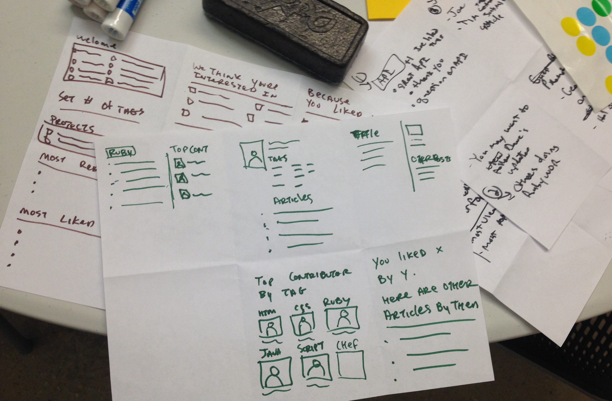
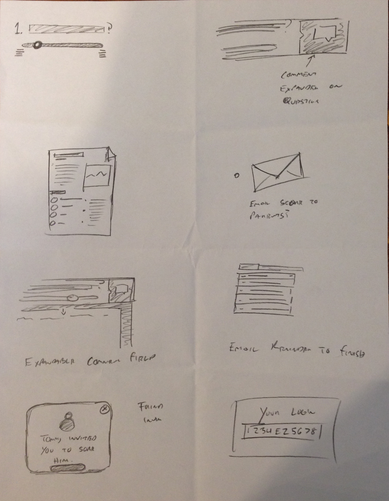
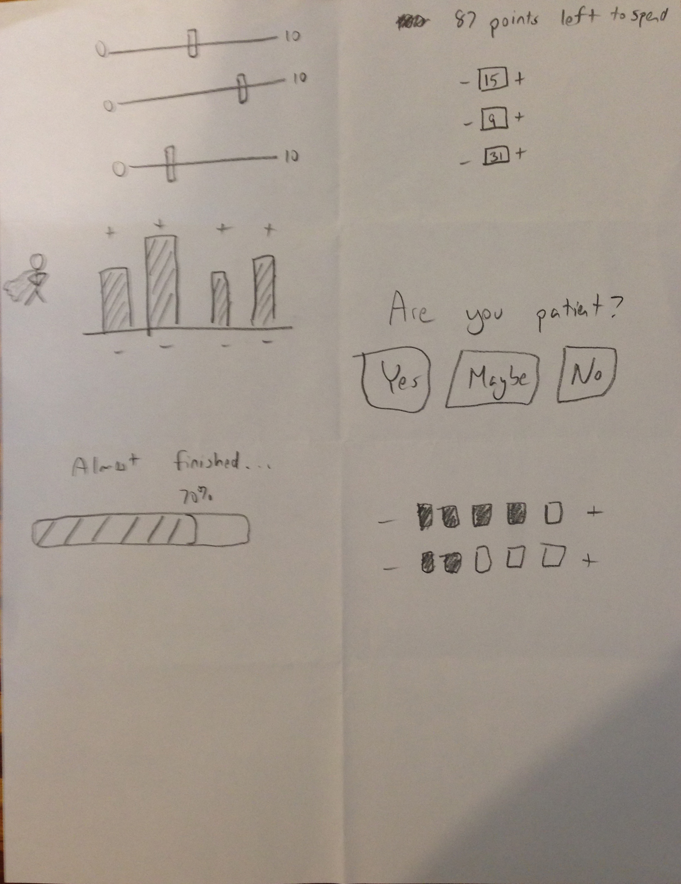

# Crazy Eights

**Supplies needed:** Computer paper, Sharpie, 
[Bit Timer app](http://www.bittimerapp.com/) or large clock

**Estimated time:** 5 min

## Best to use when

Crazy Eights work really well for coming up with a lot of varied ideas or
iterative ideas on an interface very quickly. The time limit doesn't allow for
participants to weed out any crazy ideas. It works great early on in the
ideation process because it loosens up creative muscles and generates lots of
ideas quickly.

They are part of the [Google Ventures Diverge](http://www.gv.com/lib/the-product-design-sprint-divergeday2)
day cycle along with 
[Mind Maps](mind-maps.md),
[Storyboards](storyboards.md),
[Silent Critique](silent-critique.md).

Originally based on the
[6-8-5](http://www.gamestorming.com/games-for-fresh-thinking-and-ideas/6-8-5s/) game.

## Instructions

1. Hand out blank paper and Sharpies to all participants.
* Have everyone fold a sheet of paper in half 4 times so they all have 8 panels
on the sheet.
* Give 5 minutes total to draw eight sketches of user interaction,
40 seconds for each panel.
Sketches should be really rough.
* Throughout the exercise continue to remind people of the time and make sure
that it is clear which sketch they should be on.
* Repeat as necessary.

## Examples

